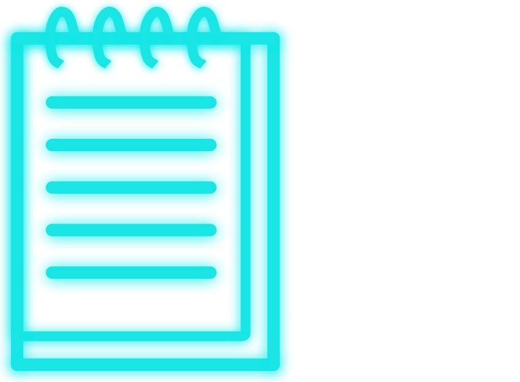
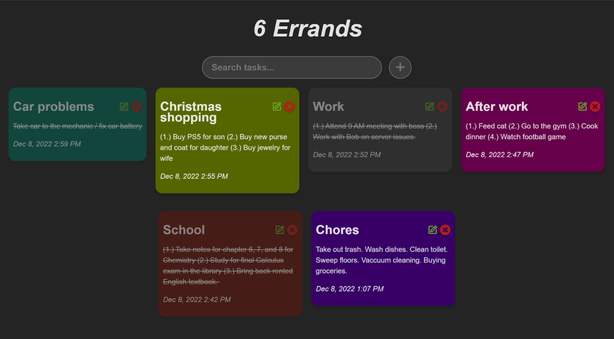

  

  An errand-tracking web application.

---

## **About the project** 🔎

A web application for creating and keeping track of your everyday errands. Similar to the [note-taking application](https://github.com/KennethOnuorah/Javascript-Notes) that I made a while ago, but with slight modifications.

Created with:

- React.js (JSX)

**Project development**: 11/6/2022 - 12/8/2022

## **Features** 📦️

- Ability to create & discard errands
- Editing/saving
- Color changing
- Completed errands indicated by strike-through (double-click)
- Time and dates
- Total errand counter
- Searching

## **Preview** 👁️

---

  

